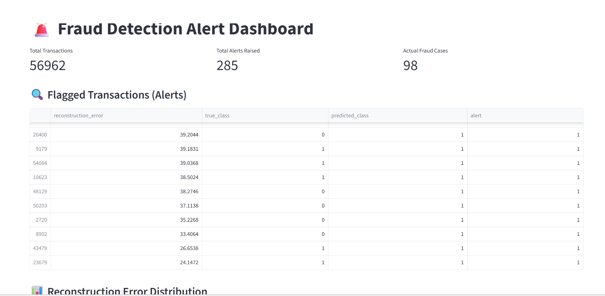
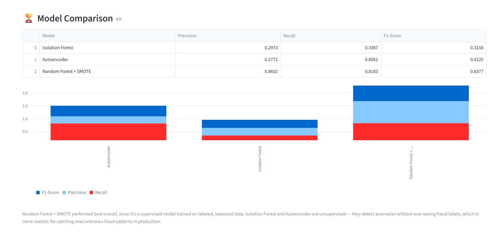

# fraud-detection-dashboard
Fraud detection using Isolation Forest, Autoencoder, and Random Forest with SMOTE
# 🚨 Credit Card Fraud Detection Dashboard

A machine learning project to detect fraudulent credit card transactions using anomaly detection and class imbalance handling techniques, with results shown on an interactive dashboard.

## 📌 Project Overview
This project identifies suspicious/fraudulent transactions using an anonymized, highly imbalanced dataset (only 0.17% fraud cases). Three different modeling approaches were built and compared to evaluate their effectiveness.

## 📸 Dashboard Preview

**Alert Dashboard**


**Model Comparison**


## 📊 Dataset
- **Source:** [Kaggle Credit Card Fraud Detection Dataset](https://www.kaggle.com/mlg-ulb/creditcardfraud)
- 284,807 transactions, 492 fraud cases (0.17%)
- Features are PCA-anonymized (V1-V28) + Time and Amount

## 🧠 Models Used
| Model | Type | Precision | Recall | F1-Score |
|---|---|---|---|---|
| Isolation Forest | Unsupervised | 0.297 | 0.337 | 0.316 |
| Autoencoder | Unsupervised (Deep Learning) | 0.277 | 0.806 | 0.413 |
| Random Forest + SMOTE | Supervised + Class Balancing | 0.860 | 0.816 | 0.838 |

**Key insight:** The supervised Random Forest model trained on SMOTE-balanced data significantly outperformed unsupervised anomaly detection methods, since it had access to labeled fraud examples during training.

## ⚙️ Techniques Used
- **Anomaly Detection:** Isolation Forest, Autoencoder (Neural Network)
- **Class Imbalance Handling:** SMOTE (Synthetic Minority Oversampling)
- **Evaluation Metrics:** Precision, Recall, F1-Score, PR-AUC (chosen over accuracy due to severe class imbalance)

## 📈 Dashboard Features
Built with **Streamlit**, the dashboard includes:
- Real-time alert metrics (total transactions, alerts raised, actual fraud cases)
- Flagged transaction table sorted by anomaly score
- Reconstruction error distribution chart
- Interactive threshold slider to adjust alert sensitivity
- Side-by-side model comparison table and chart

## 🛠️ Tech Stack
- Python, Pandas, NumPy
- Scikit-learn (Isolation Forest, Random Forest, SMOTE via imbalanced-learn)
- TensorFlow/Keras (Autoencoder)
- Streamlit (Dashboard)

## 🚀 How to Run Locally
```bash
pip install -r requirements.txt
streamlit run app.py
```

## 📁 Files
- `Credit_Card_Fraud_Detection.ipynb` — Full analysis notebook (EDA, preprocessing, modeling, evaluation)
- `app.py` — Streamlit dashboard code
- `fraud_alerts.csv` — Model output data used by dashboard
- `model_comparison.csv` — Model performance comparison data
- `requirements.txt` — Python dependencies

## 👤 Author
[Tejaswini]
